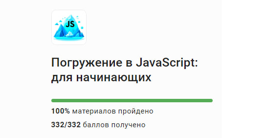
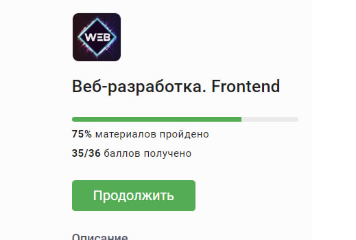
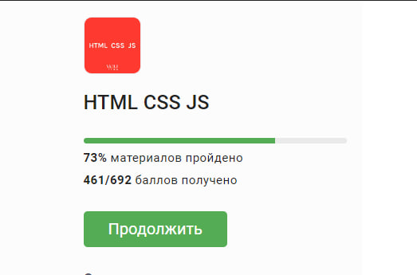

# [rsschool-cv]()

# **Bondar Yulia**  
                        

### *Student of the Belarusian National Technical University </br> Faculty of Information Technologies and Robotics*

***

## *Contact information:*
Phone: +375 (29) 20- 398-54

G-mail: uliabondar@gmail.com

Telegram: @juliaabondar

Instagram: [bondarjuliaa_](https://instagram.com/bondarjuliaa_?igshid=OHJzemkxdW9xNzBw)
***
##  **Briefly About Myself:**
Having entered the university in 2022, namely the Belarusian National Technical University, I began to think about who I could be. I chose the Faculty of Information Technology and Robotics, I was interested in the IT field.

 I started learning everything from the very beginning. I got a good basic knowledge of C++, Python. Everything seemed new and complicated to me. 
 
 In the summer of 2023, she completed an internship from the university at EPAM. I chose the Front-End direction. From the very beginning I had no idea what it was about, but gradually delving into my studies and the practice itself, I was dragged out. After practice, I decided for myself that I want to develop this direction and delve into this area. I Studied HTML And CSS. Next, the basics of JS.
 
  I am distracted from my main studies by creating websites, I like to do this and improve my knowledge. 
  
  Strengths: Perseverance, good perception of the material, interest in work, I like to learn new things. 
  
  Goals: To realize yourself as a Front-End developer.

***
## Skills:
* HTML5
* CSS5
* JavaScript Basics
* Git, GitHub
* VS Code, Intellij IDEA, Webstorm
***
## Code example:
Example with CODEWARS: *Find the sum of the elements* (JavaScript)

```
int multiply(int a, int b)
{
    int sum = a * b;
    return sum;
}
```


*In this kata you are required to, given a string, replace every letter with its position in the alphabet.*

*If anything in the text isn't a letter, ignore it and don't return it* (JavaScript).
```
{
    function alphabetPosition(text){
        const alphabet = 'abcdefghijklmnopqrstuvwxyz';
  const loweredStr = text.toLowerCase();
  let result = '';

  for (let i = 0; i < loweredStr.length; i++) {
    const char = loweredStr[i];
    const charIndex = alphabet.indexOf(char);

    if (charIndex !== -1) {
      const position = charIndex + 1;
      result += position.toString() + ' ';
    }
  }

  return result.trim();
    }
}
```
## Courses:

I took courses at Stepik:

* **Immersion in JavaScript: for beginners**
  

* **Frontend** 
  
  


* HTNL/CSS/JS
   
  
  
But that's not all the knowledge I have!

***
## Languages:
* English (Basic).
* Russin
***

## Education: BNTU

